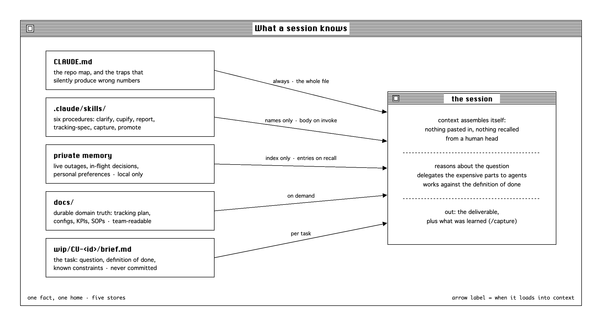
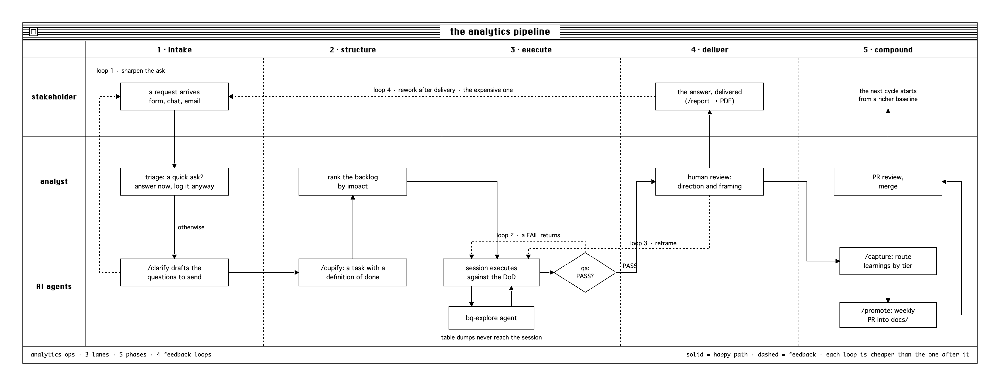
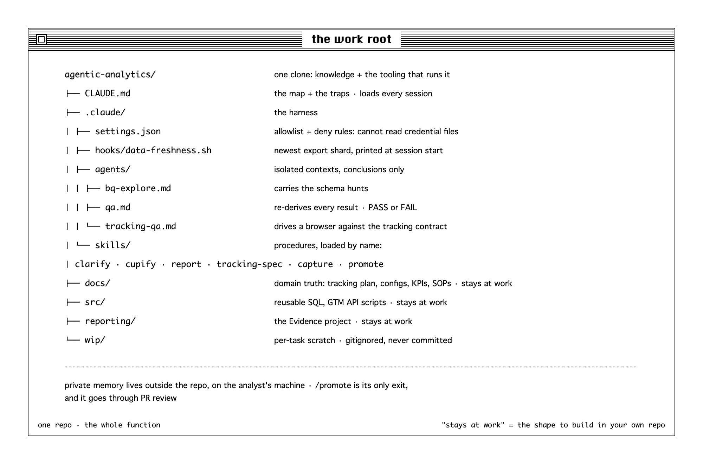
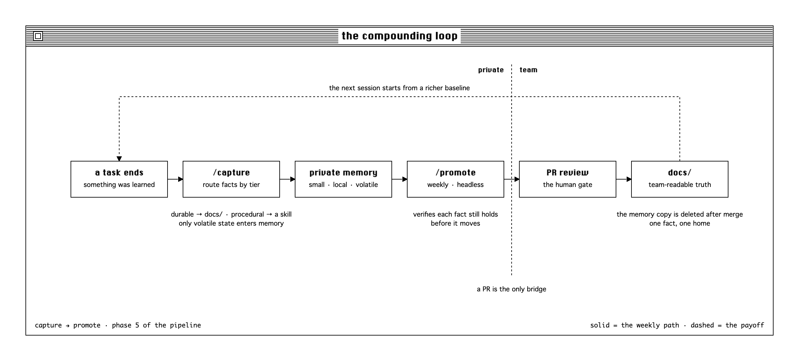

# agentic-analytics

One person runs the whole analytics function of a startup: intake, tracking plans, BigQuery
pipelines, QA, shipped reports. The way that scales is not working faster, it is operating a
system in which AI agents do the work while the human sets direction and holds the quality bar.

This repo is that system: the real harness files from production, sanitized. The company is "a
startup" throughout; ids, vocabularies and event names are placeholders. Everything else -
the structure, the skills, the agents, the rules - is exactly what runs every day.

## A harness is three things

**Model + tools + skills. That is all there is to an AI harness.**

The model is rented (here: Claude, through Claude Code). Tools are what it can touch: a shell,
BigQuery, a browser, the task tracker. Skills are written procedures it can be handed. Everything
else in this repo is arrangement - deciding what the model sees, what it may do, and what it must
never do silently.

That framing matters because it removes the mystique. Nothing below required custom
infrastructure. It is markdown files, one shell script, and a folder convention, arranged
deliberately.

## Three ways to engage AI

| Mode | What happens | Best when |
|---|---|---|
| **Automation** | AI executes a task you define (summarize, draft, plan) | You know exactly what you want |
| **Augmentation** | You and AI think through a task together | The solution is not straightforward and you need room to explore |
| **Agency** | You configure AI to act on your behalf: director, not scriptwriter | Routine interactions can run without you |

No mode is better; one project may use all three. But an analytics function has enough recurring
shape - requests arrive, get scoped, queried, checked, delivered - that mode three pays off, *if*
you build rails. This repo is the rails.

## What it optimizes for

One objective: **minimize the time from raw data to a trusted insight, on the question that
matters most right now.** Two bounds come before speed:

- **Direction.** Humans decide what is worth working on. Speed in the wrong direction is waste.
- **Accuracy.** A hard constraint, not a trade-off. Fast but wrong is a failure, not a near miss.

Within the right direction and under the accuracy bar, speed is what gets maximized. Agents
supply the speed; the human sets the direction and the bar. When the three conflict, direction
beats accuracy and accuracy beats speed, never the reverse.

Every structural choice below traces back to one of those three. If a mechanism seems fussy, ask
which bound it enforces.

## One repo is the whole system

Knowledge and the tooling that operates on it live in one clone. Open the repo in Claude Code and
the session assembles its own context - nothing is pasted in, nothing lives in one person's head
or a private notes app.

The design rule behind it: **one fact, one home, chosen by how often it is needed and how fast it
goes stale.**

| Store | Loaded | Holds | Goes stale |
|---|---|---|---|
| `CLAUDE.md` | every session | the repo map, and the traps that silently return a wrong number | slowly |
| `.claude/skills/` | name only, body on invoke | procedures with steps | slowly |
| `docs/` | on demand | durable domain truth, team-readable | slowly |
| private memory | index every session | live outages, in-flight decisions, preferences | fast |
| `wip/` | never committed | per-task scratch | immediately |

`CLAUDE.md` is deliberately small: everything in it costs context on every single session, so it
carries only what changes an answer. Detail lives in `docs/` and is read when needed. Before this
rule existed, the same fact lived in private notes *and* the repo, nothing kept the copies in
sync, and whichever one was edited quietly made the other wrong.

## The pipeline

Every request runs through one pipeline: intake, structure, execute, deliver, compound. Trivial
asks are handled on the spot but still logged; everything else is structured and reviewed against
the goal before it ships.

The four dashed loops are the accuracy mechanism, ordered by cost:

1. **Clarify at intake.** `/clarify` reads the request, checks what the data can actually answer,
   and drafts the questions; the analyst approves and sends. A question corrected here costs
   nothing; the same correction after delivery costs the whole task.
2. **Iterate inside the session.** The executing session works against a written definition of
   done (`/cupify` produces it), delegating schema hunts to the `bq-explore` agent so exploration
   noise never crowds out reasoning.
3. **The QA gate.** The `qa` agent independently re-derives every result by its own route before
   a human sees it. Two routes agreeing is evidence; one route re-read twice is not. Failures go
   back to the session, not to someone's desk.
4. **Human review, last.** Because it happens on work that already passed QA, it is a direction
   and framing check, not a correctness hunt. This is where the accuracy bound hands off to the
   direction bound.

The expensive loop - a stakeholder bouncing a delivered answer - is the argument for the three
cheaper loops in front of it.

Tracking work (new events, redesign instrumentation) runs its own five-step flow through
`/tracking-spec`: define, spec, build, QA, ship. Same idea, different contract: a tracking change
is written once, built by two teams, and verified twice, days apart.

## The parts

### CLAUDE.md, and the traps pattern

[`CLAUDE.md`](CLAUDE.md) is what every session reads first: a one-screen map of the repo, and
then the most valuable section in the whole system - **Traps**. Every entry is a way this
specific stack returns a *plausible number that is wrong*: an export that lags two days, a form
event that over-fires 8x, a param that hides in three value types, events that died silently and
still chart as zeros.

Generic LLMs know SQL; they do not know that your `source_surface` param is mis-tagged 96% of the
time. Traps are the cheapest accuracy mechanism available: one line, loaded into every session,
converting a class of silent errors into a checked assumption. Start your own harness here.

### Skills

Written procedures, invoked by name. Only the name and a one-line description sit in context
until one is called, so a large procedure library costs almost nothing per session.

| Skill | Does |
|---|---|
| [`/clarify`](.claude/skills/clarify/SKILL.md) | Drafts the clarifying questions for a vague request, grounded in what the data can actually answer. Drafts only; the analyst sends. |
| [`/cupify`](.claude/skills/cupify/SKILL.md) | Turns rough notes into a tracked task with a checkable definition of done, and lands a local brief for the executing session. |
| [`/report`](.claude/skills/report/SKILL.md) | Runs the Evidence reporting pipeline end to end: notebook, build, deploy, PDF. Pauses for review before deploying, always. |
| [`/tracking-spec`](.claude/skills/tracking-spec/SKILL.md) | The GTM/GA4 tracking pipeline: define, spec, build, QA, ship. Five modes, two documents, controlled vocabularies enforced. |
| [`/capture`](.claude/skills/capture/SKILL.md) | Distils a session's learnings into memory, and routes durable facts to `docs/` instead. |
| [`/promote`](.claude/skills/promote/SKILL.md) | Weekly, automated. Graduates durable facts out of private memory into `docs/`, as a reviewable PR. |

Two properties worth stealing. Skills encode *corrections*: half the lines in `/report` exist
because something once went subtly wrong (a notebook that "ran" and wrote nothing, a markdown
parser that eats tildes). And skills end at decision boundaries: `/clarify` drafts but never
sends, `/report` never deploys without a checkpoint, `/tracking-spec` stops at the KPI gate.
The skill does the work; the human keeps the judgment calls.

### Agents

Subagents run in their own context and return only a conclusion. This is the point: a BigQuery
schema hunt can burn a hundred thousand tokens of table dumps and empty results, and none of that
needs to reach the session doing the reasoning.

| Agent | Does |
|---|---|
| [`bq-explore`](.claude/agents/bq-explore.md) | Schema hunting and query iteration. Returns a validated query, the numbers, the scan cost, and the caveats. |
| [`qa`](.claude/agents/qa.md) | Independent correctness gate for a **result**. Re-derives it by its own route rather than reviewing yours, and returns PASS or FAIL. |
| [`tracking-qa`](.claude/agents/tracking-qa.md) | Independent correctness gate for an **implementation**. Drives a real browser through every surface in a tracking spec, reads the `dataLayer` and the emitted GA4 hits, and checks each contract row. |

The `qa` agent is deliberately not a reviewer. Reviewing the author's query anchors on the
author's framing; re-deriving from the brief by a different route catches the errors that
reviewing cannot.

### Hook and settings

[`data-freshness.sh`](.claude/hooks/data-freshness.sh) runs at session start and prints the
newest finalized GA4 export shard. Assuming today's data exists is the most common cause of a
wrong answer on a GA4 warehouse, and the check reads table metadata only, so it costs nothing.

[`settings.json`](.claude/settings.json) allowlists the read-only commands sessions use
constantly (so they run without prompts) and denies the dangerous ones outright: `bq rm`, and
*reading credential files at all*. An agent that cannot read a key cannot leak it.

## Compounding

Phases one to four take a request from intake to a delivered answer. Phase five is what makes the
next trip cheaper: nothing in it serves the current task.

`/capture` runs before a task is considered done. It harvests what the session *discovered* (not
looked up), then routes each fact by tier: durable platform truth goes to `docs/`, procedure
corrections go into the relevant skill, and only volatile private state - a live outage, an
in-flight decision - is written to memory. The routing is the point. Memory loads every session,
so it is kept small; the failure mode it prevents is a memory index that quietly becomes a second,
stale documentation tree.

`/promote` runs weekly, headless, from a scheduled job with a scoped tool allowlist. It verifies
each candidate fact still holds, folds it into the right `docs/` file, and opens a PR. Review
stays human, and after the merge the memory copy is deleted - two copies of one fact drift, and
the docs copy is the one the team reads. An empty week is a deliberate no-op.

The loop means each week's sessions start from a richer baseline than the last. That is the
compounding, and it is also the privacy boundary: a PR is the only route from one person's
private memory into the shared repo.

## What is deliberately not here

- **The `docs/` tree.** At work it holds the tracking plan (one page per event), platform
  configs, KPI definitions, dashboard specs, and the SOPs. It is the startup's data dictionary,
  so it stays home. The map in `CLAUDE.md` shows the shape to build.
- **Credentials.** No tokens, passwords or key paths, ever - the settings deny rules and three
  separate skill rules enforce it. Credentials live in a password manager and private memory.
- **Private memory.** Each person's memory store is local to their machine and never committed.
  `/promote` is the only bridge, and it goes through PR review.

## Adapting it

The order that worked, if you are building your own:

1. **Write the traps.** Start `CLAUDE.md` with the map and five ways your stack returns plausible
   wrong numbers. This pays for itself on day one.
2. **Add the exploration and QA agents.** Context isolation for the expensive parts, independent
   re-derivation for anything a stakeholder will see.
3. **Add `/capture` and `/promote`.** The compounding loop, and the discipline of one fact, one
   home.
4. **Turn your recurring procedures into skills**, one correction at a time. A skill is just the
   postmortem you never have to re-learn.

Then replace the placeholders (`your-gcp-project`, `analytics_XXXXXXXXX`, the tracker ids in
`/cupify`) and delete what your stack does not need.

## Does it work

The metric is median time from request to delivery, with rework iterations per task as the guard.
Rework is the tell: iterations climbing means the work is pointed the wrong way or the accuracy
bar is being missed, and either one makes a faster median meaningless.

One person now covers intake to delivery across tracking, warehouse, dashboards and reports. The
honest caveat: the harness did not remove the analyst, it moved the analyst up a level - from
writing every query to directing the system that writes them and auditing what it returns. That
is the "agency" mode from the table at the top, and the rails are what make it safe.

---

MIT licensed. Built with [Claude Code](https://claude.com/claude-code); the pattern transfers to
any harness with files, tools and subagents.
