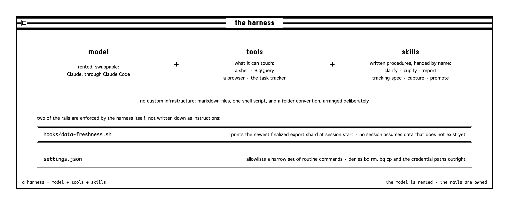

# agentic-analytics–for-startups

One person runs the whole analytics function of a startup: intake, tracking, warehouse, QA,
delivered reports. This repo is the system that makes that workable - an agent harness in which
AI does the work while the human sets direction and holds the quality bar.

The files are the production ones. The company is a startup, ids and event names are
placeholders; the structure, skills, agents and rules are exactly what runs every day. The
knowledge and delivery trees - `docs/`, `src/`, `reporting/` - hold company data; what is published is the harness that operates them.

**Outline**

1. [Where analytics sits in an org](#where-analytics-sits-in-an-org) - the constraint this solves
2. [Three ways to engage AI](#three-ways-to-engage-ai) - the move: from doing the work to directing it
3. [What the system optimizes for](#what-the-system-optimizes-for) - the objective, and its two bounds
4. [The system](#the-system) - one repo, one pipeline, one compounding loop

## Where analytics sits in an org

Data teams get organized three ways, and with trade-offs:

| Model | Wins | Loses |
|---|---|---|
| **Centralized** - one team serves everyone | standards, depth, one platform | a queue, and distance from business context |
| **Embedded** - analysts inside each function | context, speed | silos, and every team reinventing the stack |
| **Hybrid** - central platform, embedded analysts | both, in theory | headcount and coordination it takes to run |

A one-person function is the centralized model at its most extreme: one set of standards, and one
brain as the queue. Its two classic failure modes - the backlog, and the distance from context -
are exactly what this system attacks. Agents take the throughput-bound work off the one pair of
hands, and a clarification loop at intake closes the context gap. The target behaviour is the
hybrid model's without the headcount.

## Three ways to engage AI

| Mode | What happens | Best when |
|---|---|---|
| **Automation** | AI executes a task you define (summarize, draft, plan) | You know exactly what you want |
| **Augmentation** | You and AI think through a task together | The solution is not straightforward and you need room to explore |
| **Agency** | You configure AI to act on your behalf: director, not scriptwriter | Routine interactions can run without you |

No mode is better, and one project may use all three. But an analytics function has enough
recurring shape - requests arrive, get scoped, queried, checked, delivered - that the third mode
pays off, *if* you build rails. Everything below is the rails.

## What the system optimizes for

One objective: **minimize the time from raw data to a trusted insight, on the question that
matters most right now.** Two bounds come before speed:

- **Direction.** Humans decide what is worth working on. Speed in the wrong direction is waste.
- **Accuracy.** A hard constraint, not a trade-off. Fast but wrong is a failure, not a near miss.

Within the right direction and under the accuracy bar, speed is what gets maximized: agents
supply the speed, the human sets the direction and the bar. The metric is median time from
request to delivery, guarded by rework iterations per task; both are read from the task tracker,
which every request enters at intake and leaves at delivery. Rework climbing means the work is
pointed wrong or the bar is being missed, and either one makes a faster median meaningless.

Every structural choice below traces back to one of those three.

## The system

A harness is three things: **model + tools + skills**. The model is rented (here: Claude, through
Claude Code). Tools are what it can touch - a shell, BigQuery, a browser, the task tracker.
Skills are written procedures it can be handed. Nothing below required custom infrastructure; it
is markdown files, one shell script, and a folder convention, arranged deliberately.

Two of the rails are enforced by the harness rather than written down as instructions: a
[session-start hook](.claude/hooks/data-freshness.sh) prints the newest finalized export shard,
so no session assumes data that does not exist yet, and
[`settings.json`](.claude/settings.json) allowlists a narrow set of routine commands while
denying `bq rm`/`bq cp` and reads of the credential paths outright.

### One repo is the whole system

Knowledge and the tooling that operates on it live in one clone. Open the repo in Claude Code and
the session assembles its own context - nothing is pasted in, nothing lives in one person's head:

The design rule: **one fact, one home, chosen by how often it is needed and how fast it goes
stale.**

| Store | Loaded | Holds | Goes stale |
|---|---|---|---|
| [`CLAUDE.md`](CLAUDE.md) | every session | the repo map, and the traps | slowly |
| [`.claude/skills/`](.claude/skills/) | name only, body on invoke | procedures with steps | slowly |
| `docs/` | on demand | durable domain truth, team-readable | slowly |
| private memory | index every session | live outages, in-flight decisions | fast |
| `wip/` | never committed | per-task scratch | immediately |

`CLAUDE.md` is deliberately small, because everything in it costs context on every session. What
earns a place there is the **Traps** section: each entry is a way this specific stack returns a
*plausible number that is wrong* - a derived table that lags two days, a form event that
over-fires 8x, events that died silently and still chart as zeros. Generic models know SQL; they
do not know your park of silent errors. One line each, loaded always, is the cheapest accuracy
mechanism in this system.

### The pipeline

Every request runs through five phases. Trivial asks are handled on the spot but still logged;
everything else is structured and reviewed against the goal before it ships:

The four dashed loops are the accuracy mechanism, and each is cheaper than the one after it:

1. **Sharpen the ask, at intake.** [`/clarify`](.claude/skills/clarify/SKILL.md) checks what the
   data can actually answer and drafts the questions - including the one that collapses the
   rest: what decision will the answer change. The analyst approves and sends. A correction here
   is free.
2. **A QA FAIL returns to the session.** The [`qa`](.claude/agents/qa.md) agent re-derives every
   result from the brief by its own route before a human sees it - two routes agreeing is
   evidence; one route re-read twice is not. For instrumentation,
   [`tracking-qa`](.claude/agents/tracking-qa.md) drives a real browser against the spec instead.
   A FAIL costs a session iteration, not a delivery.
3. **Human review reframes, last.** Because it lands on work that already passed QA, it is a
   direction and framing check, not a correctness hunt.
4. **Rework after delivery** - a stakeholder bouncing a delivered answer. It costs the whole
   task, and the three loops before it exist to starve it.

On the solid path between those loops, work runs against a written definition of done
([`/cupify`](.claude/skills/cupify/SKILL.md) produces it, and the brief carries the decision the
answer serves), with schema hunts delegated to the
[`bq-explore`](.claude/agents/bq-explore.md) agent so exploration noise never crowds out
reasoning.

Delivery itself runs through [`/report`](.claude/skills/report/SKILL.md). Tracking work runs its
own define-spec-build-QA-ship flow through
[`/tracking-spec`](.claude/skills/tracking-spec/SKILL.md), which stops at a KPI gate: a proposed
metric must feed a KPI row or a named decision, or it goes back to the requester to sharpen or
drop.

### The compounding loop

The phases above take one request from intake to delivery. The fifth phase serves the next
request instead of the current one:

[`/capture`](.claude/skills/capture/SKILL.md) runs before a task closes and routes what the
session *discovered* by tier: durable facts toward `docs/`, procedure corrections into the
relevant skill, and only volatile state into private memory - which loads every session, so it is
kept ruthlessly small. [`/promote`](.claude/skills/promote/SKILL.md) runs weekly and headless: it
verifies each candidate fact still holds, folds it into `docs/`, and opens a PR. After the merge
the memory copy is deleted - two copies of one fact drift. The PR is also the privacy boundary:
the only route from one person's private memory into the shared repo, and it passes human review.

Each week's sessions start from a richer baseline than the last. That is the compounding.

---

MIT licensed. Built with [Claude Code](https://claude.com/claude-code); the pattern transfers to
any harness with files, tools and subagents.
